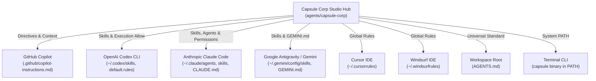
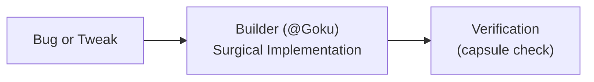
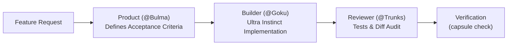
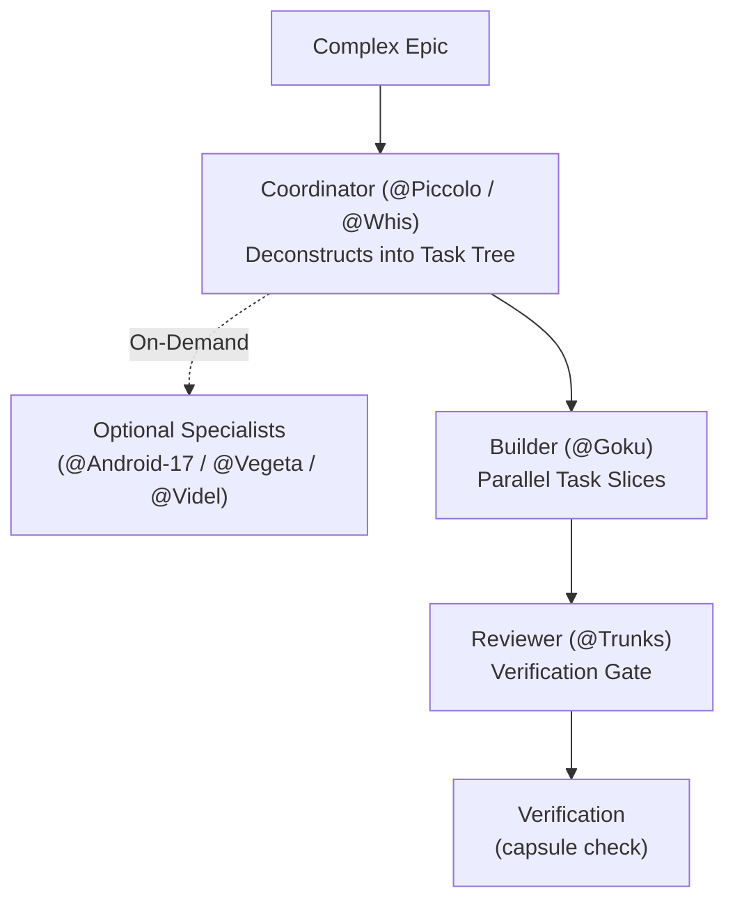

# ⚡ Capsule Corp: Autonomous Multi-AI Agent Cohort

A specialized cohort of autonomous AI agents modeled on **Dragon Ball Z** archetypes, engineered for startups and unified across all development tools (**GitHub Copilot**, **OpenAI Codex**, **Anthropic Claude Code**, **Google Antigravity / Gemini**, **Cursor**, and **Windsurf**).

> *"I like to call it the Michelin kitchen… when you say software factory, it has this connotation of mass manufactured slop."* — **Lauren Tan** (@poteto, *Behind the Craft*)

*Inspired by an interview with poteto (Lauren Tan) and the way they structure their agents: hearing Lauren describe her Michelin kitchen approach inspired me to build my own version—adapting her core agentic engineering principles into the Capsule Corp cohort.*

---

## Getting Started

Capsule Corp does not require a system-wide installation. Clone the repository and run the local executable:

```bash
git clone <repository-url>
cd capsule-corp
./bin/capsule list
```

### Prerequisites

- Python 3.8 or newer
- Git, for change and diff verification
- PyYAML, required by the full test suite and formatted registry output:

  ```bash
  python3 -m pip install PyYAML
  ```

Project-specific tools such as `pytest`, `npm`, `cargo`, or `go` are only needed when verifying a project that uses them.

### Run the built-in checks

```bash
capsule check .      # Everyday factual check: tests, lint, typecheck, secrets
capsule test         # Cohort test suite
capsule verify .     # Trunks' strict verification gate
capsule security .   # Android 17's security scanner
```

All commands should exit with code 0 before treating changes as ready.

### Route a request when you are unsure

Ask Whis first, or inspect the deterministic routing policy directly:

```bash
capsule route "We need an accessible onboarding flow with good error states"
```

The command returns one owner and the expected handoff chain. If the request is ambiguous, it returns `needs_clarification` and assigns it to Whis rather than guessing.

### Windows quick start

From PowerShell or Command Prompt, use the Windows launcher:

```powershell
.\bin\capsule.cmd list
.\bin\capsule.cmd test
.\bin\capsule.cmd verify .
.\bin\capsule.cmd security .
```

The launcher uses `py` when available and falls back to `python`. You can also invoke the Python script directly:

```powershell
py .\bin\capsule list
```

The `config/*.sh` synchronization scripts require Git Bash, WSL, or another Bash environment on Windows. Do not use the Unix `export PATH=...` command in PowerShell; configure Windows PATH through the environment-variable settings or use `.\bin\capsule.cmd` directly.

### Make `capsule` available in your shell

For the current shell session:

```bash
export PATH="$PWD/bin:$PATH"
capsule list
```

To make that permanent, add the equivalent `export PATH=...` line to your shell startup file. The local `./bin/capsule` path always remains available.

### Optional global installation

Capsule is also a Python package. Use `pipx` for an isolated global command when it is available:

```bash
pipx install /path/to/capsule-corp
capsule list
```

Or install it into your user Python environment:

```bash
python3 -m pip install --user /path/to/capsule-corp
```

On Windows, use the Python launcher:

```powershell
py -m pip install --user C:\path\to\capsule-corp
capsule list
```

If PowerShell says `capsule` is not recognized after a `--user` install, add Python's user `Scripts` directory to PATH. Print the exact directory for the active Python installation with:

```powershell
py -c "import sysconfig; print(sysconfig.get_path('scripts', scheme='nt_user'))"
```

Alternatively, use the full path printed by that command or install with `pipx`, which manages the executable location.

If `where.exe capsule` shows `capsule` from the repository's `bin` directory before the Python user `Scripts` directory, the repository launcher is shadowing the installed command. Remove the repository `bin` entry from PATH or move the user `Scripts` directory ahead of it, then open a new terminal. An installer cannot safely change PATH ordering for you.

For dependency auditing, install Capsule's optional security tools:

```bash
python3 -m pip install "/path/to/capsule-corp[security]"
```

The package provides the same `capsule init --tool ...` behavior on macOS, Windows, and Linux. The source checkout and `./bin/capsule`/`bin\capsule.cmd` launchers remain supported.

### Connect a project to Copilot

```bash
./bin/capsule init --tool copilot /path/to/project
./bin/capsule verify /path/to/project
./bin/capsule security /path/to/project
```

By default, `init` installs only the integration you select and preserves unrelated tool files. To configure several tools intentionally:

```bash
./bin/capsule init --tools copilot,codex,cursor,gemini /path/to/project
```

`init` preserves existing instruction files. Replacing selected guidance requires an explicit choice:

```bash
./bin/capsule init --tool copilot --force /path/to/project
```

### Sync AI-tool skills and rules safely

Preview global changes before applying them:

```bash
./bin/capsule sync --dry-run
```

Apply the changes only after reviewing the preview:

```bash
./bin/capsule sync --force
```

Forced replacements create timestamped backups. Do not run global sync on a shared machine without checking the target paths.

For detailed situation-based workflows, see the [Capsule Corp Cookbook](cookbook/README.md).

## 1. Role Architecture: Core 4 + Optional Specialists

Rather than forcing every request through a large roster, Capsule Corp structures work around **four default roles** and calls **specialists only when needed**. Functional names clarify responsibilities; Dragon Ball archetypes provide memorable shorthand aliases.

### The Core 4 Default Roles
| Role | Alias | Operational Focus | Primary Job To Be Done (JTBD) |
| :--- | :--- | :--- | :--- |
| **Product** | `@Bulma` | MVP Scoping & Acceptance Criteria | Translates founder ideas into sharp PRDs, user flows, API specs, and testable acceptance criteria before code is written. |
| **Builder** | `@Goku` | Ultra Instinct Frontline Execution | Surgical implementation with Ultra Instinct focus. Lean code, minimal diffs, zero speculative dependencies or conversational filler. |
| **Reviewer** | `@Trunks` | Verification Gate & Review | Executes automated tests, linters, typecheckers, and git diff audits before code is accepted. Guarantees zero regressions. |
| **Coordinator** | `@Piccolo` / `@Whis` | Strategy & Orchestration | Deconstructs complex features into atomic task trees. Orchestrates parallel tasks and invokes specialists when needed. Never writes code directly. |

### Optional Specialists (Called On-Demand Only)
Specialists are called only when a task strictly requires their specific expertise—never for everyday changes:
| Specialist | Role | Operational Focus | When to Call |
| :--- | :--- | :--- | :--- |
| **@Android-17** | **Security Sentinel** | Zero-Trust & Vulnerability Audit | Auth systems, secret audits, OWASP risks, dependency CVEs, and input sanitization. |
| **@Android-18** | **Refactoring Specialist** | Dead Code & Tech Debt | Component extraction, duplicate cleanup, and technical debt with zero behavioral changes. |
| **@Videl** | **UX Researcher & Designer** | Usability & Accessible States | User journey flows, accessibility (WCAG), empty states, and error handling for user interfaces. |
| **@Vegeta** | **DevOps Commander** | Infrastructure & Scale | Multi-stage Dockerfiles, GitHub Actions CI/CD pipelines, database migrations, connection pooling. |
| **@Master-Roshi** | **Game Feel Master** | Core Loops & Canvas Mechanics | Game feel, sprite math, frame timing, physics loops, and difficulty tuning. |
| **@Dr-Gero** | **Meta-Agent Architect** | System Scaffolding & Evals | Scaffolding new agents, authoring skills, and auditing execution transcripts for agent friction. |

---

## 2. Universal Multi-AI Connection Architecture

Capsule Corp connects globally to every AI tool on your machine through automated bridges:



### Where Everything Connects:
1. **GitHub Copilot:**
   - Full repository guidance in [`.github/copilot-instructions.md`](.github/copilot-instructions.md).
   - Supported in VS Code, GitHub.com PR reviews, and Copilot Workspace.
2. **Universal Workspace Standard:**
   - `AGENTS.md` at your dev workspace root. Codex, Claude, Cursor, Windsurf, and Copilot automatically load these directives in all sub-projects.
3. **OpenAI Codex:**
   - Skills linked to `~/.codex/skills/`
   - Permissions configured in `~/.codex/rules/default.rules` so Codex can run `capsule verify` and `capsule security` without prompting.
4. **Claude Code:**
   - Subagents linked to `~/.claude/agents/` (and `.claude/agents/` locally) for native task delegation (`@bulma`, `@goku`, `@piccolo`, `@android-17`, `@trunks`, etc.).
   - Skills linked to `~/.claude/skills/` as slash commands (`/verification-gate`, `/audit-transcripts`, `/scaffold-agent`).
   - Project and user directives in `CLAUDE.md` and `~/.claude/CLAUDE.md`.
   - Automated execution permissions configured in `~/.claude/settings.json` and `.claude/settings.json`.
5. **Google Antigravity / Gemini:**
   - Skills linked to `~/.gemini/config/skills/`
   - Global rules in `~/.gemini/GEMINI.md`.
6. **Cursor & Windsurf:**
   - Global rules configured in `~/.cursorrules` and `~/.windsurfrules`.

---

## 3. How to Use Capsule Corp in Any AI

Because all your AIs share the same cohort definitions, skills, and CLI tools, you can invoke the cohort seamlessly anywhere:

### A. In GitHub Copilot (VS Code / Copilot Chat / PR Reviews)
Prompt Copilot using persona tags:
* **@Bulma for Specs:** *"@Bulma, turn this user story into a full PRD with API schemas and acceptance criteria."*
* **@Android-17 for Security:** *"@Android-17, review this pull request for secret leaks, injection risks, and OWASP vulnerabilities."*
* **@Vegeta for DevOps:** *"@Vegeta, write an optimized multi-stage Dockerfile and GitHub Actions CI workflow for this service."*
* **@Goku for Code:** *"@Goku, implement the user authentication endpoint with zero conversational fluff."*

### B. In OpenAI Codex CLI (`codex`)
Run `codex` in your terminal:
```bash
codex
```
Then prompt Codex:
* **Decompose an Epic:** *"Piccolo, review this project and break down the payment integration into an atomic task tree."*
* **Security Audit:** *"Android 17, run a security scan on this repository and check for leaked keys."* (Codex will run `capsule security` with full permission).
* **Verify Code:** *"Trunks, run the verification sentinel on this repository."* (Codex will execute `capsule verify`).

### C. In Anthropic Claude Code (`claude`)
Launch Claude Code in any project:
```bash
claude
```
Then leverage the native cohort integration:
* **Custom Subagents:** Use `/agents` to view active specialists, or prompt directly:
  * *"Bulma, outline the MVP schema and API endpoints for our onboarding flow."*
  * *"Goku, implement the database query in models.py with zero fluff and add unit tests."*
  * *"Android 17, scan this repository and dependencies for security risks."*
  * *"Trunks, run the verification gate and inspect our diff."*
* **Slash Commands:** Execute cohort skills directly:
  * `/verification-gate` - Run Trunks' verification matrix and diff audit.
  * `/audit-transcripts` - Audit session transcripts for friction and prompt patches.
  * `/scaffold-agent` - Interactively scaffold a new single-responsibility agent.
* **Project Bootstrap:** Initialize any repository with `capsule init --tool claude /path/to/project` to generate `CLAUDE.md` and `.claude/settings.json`.

### D. In Google Antigravity / Gemini
In your chat or CLI session:
* The subagents `bulma`, `videl`, `piccolo`, `goku`, `android-17`, `trunks`, `vegeta`, `android-18`, `dr-gero`, and `whis` are natively registered.
* Simply say: *"Bulma, scope this feature"* or *"Android 17, audit this codebase for security"*.
* Initialize projects with `capsule init --tool gemini /path/to/project` (or `--tool agy`) to generate `GEMINI.md`.

---

## 4. The `capsule` Everyday CLI Reference

The CLI is available in PATH (`capsule`) and locally (`./bin/capsule`). Everyday engineering centers around factual checks, diagnostics, and routing:

```bash
# 1. Everyday factual checks (tests, linters, typecheckers, diff audit)
capsule check [project_dir]
capsule check --json [project_dir]

# 2. Check-In Room & Timeclock (Multi-AI Coordination)
capsule room [project_dir]                              # View active agents, models, and claimed files
capsule clock-in --task "Add auth API" --files "auth.py" # Clock in to shift (auto-detects agent & model)
capsule clock-out --summary "Auth added and verified"   # Clock out (auto-prunes logs to prevent bloat)
capsule room --clean                                    # Reset/clear active shifts

# 3. Heuristic request routing & workflow tier suggestion
capsule route "fix typo in button class"
capsule route "design an accessible onboarding flow"
capsule route --json "deconstruct architecture into task tree"

# 4. Multi-AI Environment & Health Diagnostics
capsule doctor [project_dir]

# 5. Strict verification gate (deterministic pass/fail for PRs and CI)
capsule verify [project_dir]
capsule security [project_dir]

# 6. Configure one AI tool by default (or multiple)
capsule init --tool codex /path/to/project
capsule init --tool claude /path/to/project
capsule init --tool gemini /path/to/project
capsule init --tools copilot,claude,cursor /path/to/project

# 7. List all agents in the cohort with roles and model tiers
capsule list

# 8. Dr. Gero's transcript friction auditor
capsule audit --latest

# 9. Synchronize skills, rules, and permissions across all AIs
capsule sync --dry-run
capsule sync --force

# 10. Run the cohort's internal test suite
capsule test
```

### Project-Specific Configuration (`capsule.json`)
Rather than guessing commands from build manifests, Capsule Corp allows projects to explicitly declare their test, lint, and typecheck commands in `capsule.json`, `.capsulerc.json`, or `pyproject.toml`:

```json
{
  "test": "npm test",
  "lint": "npm run lint",
  "typecheck": "tsc --noEmit"
}
```

Or in `pyproject.toml`:
```toml
[tool.capsule]
test = "pytest -v"
lint = "ruff check ."
typecheck = "mypy src"
```

When configured, `capsule check` and `capsule verify` execute these explicit project commands and report factual `[PASS]`, `[FAIL]`, and `[SKIP]` statuses with execution times.

---

## 5. Tiered Workflows That Scale

Avoid forcing every request through the entire cohort. A simple CSS fix or typo should never require product scoping, multi-agent orchestration, and security review. Match the workflow to the task:

### 1. Small Fix (Single change, typo, bugfix, CSS tweak)


### 2. Standard Feature (New endpoint, UI component, user story)


### 3. Complex Epic (Multi-service migration, system redesign, auth overhaul)


### The Standard Task Brief Envelope
Every role and subagent communicates through a compact, structured envelope rather than conversational introductions or repeated backstories:

```markdown
### Task Brief
- **Goal:** [1-2 sentences stating what is being built or fixed and why]
- **Scope:** [Exact files, surfaces, or endpoints touched]
- **Constraints:** [Tech boundaries, no unrequested refactors, zero external dependencies]
- **Acceptance Criteria:** [Testable bullets asserting observable behaviors]
- **Verification:** [Explicit commands to run: e.g. capsule check, pytest, npm test]
```

---

## 6. Multi-AI Check-In Room & Timeclock (Collision-Free Collaboration)

When multiple autonomous agents (e.g. Claude Code, OpenAI Codex, Google Antigravity, Cursor, Windsurf) work concurrently in the same codebase, coordination is essential to prevent conflicting edits and overwritten files.

Capsule Corp solves this with a lightweight, file-backed Check-In Room stored in `.capsule/room.json` and rendered into human-readable `.capsule/CONFERENCE.md`:

```
                 ┌────────────────────────────────────────────────┐
                 │       🏛️  Capsule Corp Check-In Room            │
                 │    (.capsule/room.json & CONFERENCE.md)        │
                 └──────▲──────────────▲──────────────▲───────────┘
                        │              │              │
             ┌──────────┴──────┐ ┌─────┴───────┐ ┌────┴─────────┐
             │   Claude Code   │ │    Codex    │ │ Antigravity  │
             │ (Anthropic 3.7) │ │  (OpenAI)   │ │   (Google)   │
             │  Clocked In:    │ │ Clocked In: │ │ Clocked In:  │
             │  Builder role   │ │ Review role │ │ Product role │
             └─────────────────┘ └─────────────┘ └──────────────┘
```

### How the Timeclock Works:
1. **Auto-Detection:** When an agent runs `capsule clock-in`, Capsule auto-detects the agent provider and model from environment variables (`CLAUDE_CODE`, `CODEX`, `GEMINI_CLI`/`ANTIGRAVITY`, `CURSOR_AGENT`, `WINDSURF_AGENT`).
2. **File Claiming & Conflict Warnings:** Passing `--files "src/auth.ts,src/db.ts"` registers active surfaces. If another agent inspects the room with `capsule room`, active file collision warnings are displayed immediately.
3. **Automatic Log Pruning & Anti-Deadlock:**
   - **Auto-Expiration:** Shifts older than 2 hours without a clock-out are automatically transitioned to history marked `[Auto-Expired]`. If an agent crashes or disconnects, files are never locked permanently.
   - **Rolling History Buffer:** Shift history is strictly capped at 15 items on every invocation. The log never bloats the repository.

---

## 7. Directory Layout

```
capsule-corp/
├── bin/
│   ├── capsule               # Unix/macOS unified CLI tool
│   └── capsule.cmd           # Windows launcher
├── .github/
│   └── copilot-instructions.md # GitHub Copilot directives
├── bots/                     # Persona specifications (One Job, One Voice)
│   ├── bulma.md              # Bulma: Product Architect & Rapid Prototyper
│   ├── videl.md              # Videl: UX Researcher & Interaction Designer
│   ├── piccolo.md            # Piccolo: Tactical Lead & Task Decomposer
│   ├── goku.md               # Goku: Frontline Code Artisan
│   ├── android_17.md         # Android 17: Security & Compliance Sentinel
│   ├── trunks.md             # Trunks: Timeline Sentinel & Verification Gate
│   ├── android_18.md         # Android 18: Precision Refactoring Specialist
│   ├── vegeta.md             # Vegeta: Infrastructure & Database Commander
│   ├── dr_gero.md            # Dr. Gero: Meta-Agent Architect & Auditor
│   ├── whis.md               # Whis: Chief of Staff & Routine Dispatcher
│   ├── goten.md              # Goten: Articulated Sprite Animation Specialist
│   ├── android_16.md         # Android 16: Rive Rig Integration Specialist
│   └── roshi.md              # Master Roshi: Game Designer & Difficulty Tuner
├── skills/                   # Progressive disclosure runbooks (synced to all AIs)
│   ├── scaffold-agent/       # Dr. Gero's bot designer
│   ├── audit-transcripts/    # Dr. Gero's session log friction auditor
│   └── verification-gate/    # Trunks' automated test & diff gates
├── scripts/                  # Automation engines
│   ├── check_project.py      # Everyday project check engine (capsule check)
│   ├── route_request.py      # Request triage & workflow suggestion (capsule route)
│   ├── security_audit.py     # Android 17's security scanner
│   ├── init_project.py       # Multi-AI project bootstrap utility
│   ├── scaffold_bot.py       # Bot creation script
│   ├── audit_transcripts.py  # JSONL transcript analysis engine
│   └── verify_project.py     # Multi-ecosystem test runner & diff scanner
├── src/capsule/              # Installable cross-platform CLI package
│   └── cli.py
├── pyproject.toml             # Python package metadata and `capsule` entry point
├── tests/
│   └── test_cohort.py        # Unit tests for Capsule Corp
├── config/
│   ├── sync_all_ais.sh       # Multi-AI sync script (Copilot, Codex, Claude, Gemini, Cursor)
│   └── sync_to_gemini.sh     # Gemini-specific sync script
├── cookbook/                  # Getting-started guide, situation recipes & runner guides
│   ├── README.md
│   ├── runners/              # Tool guides: Claude Code, Gemini, Codex, Cursor, Windsurf, Copilot
│   └── situations/
├── registry.yaml             # Master cohort manifest & tool allowlists
└── README.md                 # This documentation guide
```

---

## 7. How to Maintain & Update

Whenever you add or edit a skill or bot persona:
1. Save the new skill in `skills/<skill-name>/SKILL.md`.
2. Run:
   ```bash
   capsule sync
   ```
This immediately updates GitHub Copilot, Codex, Claude Code, Gemini, Cursor, and Windsurf simultaneously.
