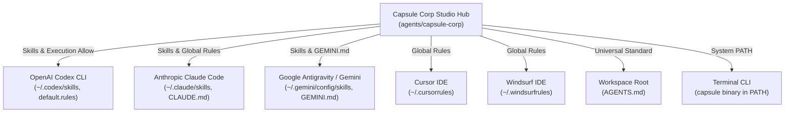
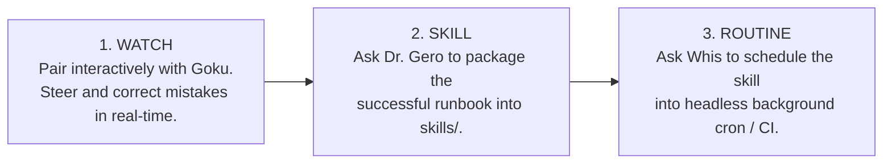

# ⚡ Capsule Corp: Autonomous Multi-AI Agent Cohort

A specialized cohort of autonomous AI agents modeled on **Dragon Ball Z** archetypes, unified across all your development tools (**Codex**, **Claude Code**, **Gemini**, **Cursor**, **Windsurf**, and **Copilot**).

*Inspired by Lauren Tan's agentic engineering concepts.*

> *"Build warriors, not generic chatbots. Single-purpose operatives, ruthless verification, and relentless execution."*

---

## 1. The Capsule Corp Roster

| Character | Role | Operational Focus | Primary Job To Be Done (JTBD) |
| :--- | :--- | :--- | :--- |
| **Dr. Gero**<br>`The Android Architect` | **Meta-Agent Architect & Auditor** | System Scaffolding & Evals | Designs, scaffolds, audits, and prunes other agents and skills. Audits conversation transcripts to eliminate friction and tool bloat. |
| **Piccolo**<br>`The Tactical Lead` | **Engineering Lead & Decomposer** | Strategy & Orchestration | Deconstructs complex feature epics into atomic task trees. Orchestrates parallel worker agents and coordinates verification. Never writes raw code directly. |
| **Whis**<br>`The Attendant & CoS` | **Chief of Staff & Routine Dispatcher** | Triage & Automation | Request triage, background routine scheduling (cron/timers), resource allocation, and developer communication. |
| **Trunks**<br>`The Timeline Sentinel` | **Verification Gatekeeper** | Zero-Regression Quality Gate | The quality gate. Runs test suites, linters, and typecheckers before code is accepted. Guarantees zero regressions. |
| **Goku**<br>`The Code Artisan` | **Frontline Implementation Worker** | Ultra Instinct Execution | Surgical code implementation with Ultra Instinct focus and high bias to act. Zero speculative dependencies or conversational filler. |
| **Android 18**<br>`Refactoring Specialist` | **Precision Refactoring Worker** | Dead Code & Tech Debt | Eliminates dead code, cleans technical debt, and extracts components with zero regression. |

---

## 2. Universal Multi-AI Connection Architecture

Capsule Corp connects globally to every AI tool on your machine through automated bridges:



### Where Everything Connects:
1. **Universal Workspace Standard:** `AGENTS.md` is placed at your dev workspace root. Codex, Claude, Antigravity, Cursor, Windsurf, and Copilot automatically climb the directory tree and load these directives in all sub-projects.
2. **OpenAI Codex:**
   - Skills linked to `~/.codex/skills/`
   - Permissions configured in `~/.codex/rules/default.rules` so Codex can run `capsule verify` and `capsule list` without prompting.
3. **Claude Code:**
   - Skills linked to `~/.claude/skills/`
   - Global rules configured in `~/.claude/CLAUDE.md`.
4. **Google Antigravity / Gemini:**
   - Skills linked to `~/.gemini/config/skills/`
   - Global rules configured in `~/.gemini/GEMINI.md`.
5. **Cursor & Windsurf:**
   - Global rules configured in `~/.cursorrules` and `~/.windsurfrules`.
6. **Open Agent Standard:**
   - Skills linked to `~/.agents/skills/`.

---

## 3. How to Use Capsule Corp in Any AI

Because all your AIs share the same cohort definitions, skills, and CLI tools, you can invoke the cohort seamlessly anywhere:

### A. In OpenAI Codex CLI (`codex`)
Run `codex` in your terminal:
```bash
codex
```
Then prompt Codex:
* **To Decompose an Epic:** *"Piccolo, review this project and break down the auth system refactor into an atomic task tree."*
* **To Verify Code:** *"Trunks, run the verification sentinel on this repository and check for any regression or diff issues."* (Codex will execute `capsule verify` with full permission).
* **To Design an Agent:** *"Dr. Gero, scaffold a new agent named 'Android 17' to audit API endpoints."*

### B. In Anthropic Claude Code (`claude`)
Launch Claude Code in any project:
```bash
claude
```
Then prompt Claude:
* *"Act as Piccolo: analyze this request, decompose it into single-responsibility tasks, and verify each step with Trunks."*
* *"Act as Goku: implement the database model change in models.py with zero fluff, and write unit tests for it."*
* *"Act as Trunks: run tests and audit git diff for secrets or unintended edits."*

### C. In Google Antigravity / Gemini
In your chat or CLI session:
* The subagents `dr-gero`, `piccolo`, `whis`, `trunks`, and `goku` are natively registered.
* Simply say: *"Dr. Gero, audit our session transcripts"* or *"Piccolo, lead this feature implementation"*.

### D. In Cursor or Windsurf
Open any folder in your dev workspace:
* In Cursor Chat / Composer or Windsurf Cascade, the agents are pre-loaded via `~/.cursorrules` and `AGENTS.md`.
* Prompt the model: *"Follow the Capsule Corp Trunks protocol: implement this change and verify all tests pass with exit code 0 before finishing."*

---

## 4. The `capsule` CLI Reference

The CLI is in your system PATH (`~/.zshrc`). You can run `capsule` from any terminal:

```bash
# 1. List all agents in the cohort with roles and model tiers
capsule list

# 2. Run Trunks' Verification Gate on any project (auto-detects pytest, npm, cargo, go, etc.)
capsule verify [project_dir]

# 3. Run Dr. Gero's transcript auditor on recent sessions to identify friction & patch prompts
capsule audit --latest

# 4. Scaffold a new specialized DBZ agent following the 4-part contract
capsule scaffold --name "android-17" \
                 --alias "Android 17 (The Security Sentinel)" \
                 --role "Security & Secrets Auditor" \
                 --description "Scans code and dependencies for vulnerabilities and leaked secrets." \
                 --jtbd "Audit pull requests and commits for security flaws and API key leaks." \
                 --verification "Security scan exits with 0 vulnerabilities."

# 5. Synchronize all skills, rules, and permissions across all AIs
capsule sync

# 6. Run the cohort's internal unit tests
capsule test
```

---

## 5. The 3-Stage Trust Engine

Whenever you build a new agentic workflow, follow this 3-step ladder:



1. **Watch (Interactive Supervised Pairing):** Solve the problem interactively with Goku.
2. **Skill (Codification):** Once it works, say: *"Dr. Gero, package that workflow into a reusable skill under `skills/<name>/SKILL.md`"*. Then run `capsule sync`.
3. **Routine (Autonomous Delegation):** Once the skill consistently succeeds in one shot, let Whis or a cron schedule run it headlessly.

---

## 6. Directory Layout

```
capsule-corp/
├── bin/
│   └── capsule               # Unified CLI tool (in PATH)
├── bots/                     # Persona specifications (One Job, One Voice)
│   ├── dr_gero.md            # Dr. Gero: Meta-Agent Architect & Auditor
│   ├── piccolo.md            # Piccolo: Tactical Lead & Task Decomposer
│   ├── whis.md               # Whis: Chief of Staff & Routine Dispatcher
│   ├── trunks.md             # Trunks: Timeline Sentinel & Verification Gate
│   ├── goku.md               # Goku: Frontline Code Artisan
│   └── android_18.md         # Android 18: Precision Refactoring Specialist
├── skills/                   # Progressive disclosure runbooks (synced to all AIs)
│   ├── scaffold-agent/       # Dr. Gero's bot designer
│   ├── audit-transcripts/    # Dr. Gero's session log friction auditor
│   └── verification-gate/    # Trunks' automated test & diff gates
├── scripts/                  # Automation engines
│   ├── scaffold_bot.py       # Bot creation script
│   ├── audit_transcripts.py  # JSONL transcript analysis engine
│   └── verify_project.py     # Multi-ecosystem test runner & diff scanner
├── tests/
│   └── test_cohort.py        # Unit tests for Capsule Corp
├── config/
│   ├── sync_all_ais.sh       # Multi-AI sync script (Codex, Claude, Gemini, Cursor, Windsurf)
│   └── sync_to_gemini.sh     # Gemini-specific sync script
├── registry.yaml             # Master cohort manifest & tool allowlists
└── README.md                 # This documentation guide
```

---

## 7. How to Maintain & Update

Whenever you add or edit a skill or bot persona:
1. Save the new skill in `skills/<skill-name>/SKILL.md`.
2. Run:
   ```bash
   capsule sync
   ```
This immediately updates Codex, Claude Code, Gemini, Cursor, and Windsurf simultaneously.
