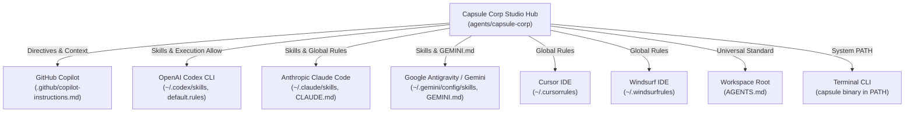
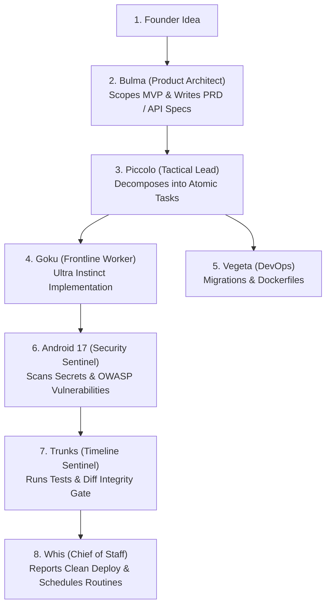

# ⚡ Capsule Corp: Autonomous Multi-AI Agent Cohort

A specialized cohort of autonomous AI agents modeled on **Dragon Ball Z** archetypes, engineered for startups and unified across all development tools (**GitHub Copilot**, **OpenAI Codex**, **Anthropic Claude Code**, **Google Antigravity / Gemini**, **Cursor**, and **Windsurf**).

*Inspired by Lauren Tan's agentic engineering concepts.*

> *"Build warriors, not generic chatbots. Single-purpose operatives, ruthless verification, and relentless execution."*

---

## 1. The Startup Cohort Roster

| Character | Role | Operational Focus | Primary Job To Be Done (JTBD) |
| :--- | :--- | :--- | :--- |
| **Bulma**<br>`Chief Product Architect` | **Product Architect & Spec Maker** | MVP Scoping & API Contracts | Translates founder ideas into sharp PRDs, user flows, and API specifications. Cuts non-essential feature bloat. |
| **Piccolo**<br>`The Tactical Lead` | **Engineering Lead & Decomposer** | Strategy & Orchestration | Deconstructs feature epics into atomic task trees. Orchestrates parallel worker agents and coordinates verification. Never writes raw code directly. |
| **Goku**<br>`The Code Artisan` | **Frontline Implementation Worker** | Ultra Instinct Execution | Surgical code implementation with Ultra Instinct focus and high bias to act. Zero speculative dependencies or conversational filler. |
| **Android 17**<br>`The Security Sentinel` | **Security & Compliance Sentinel** | Zero-Trust & Vulnerability Audit | Inspects codebases and PRs for exposed secrets, OWASP vulnerabilities, injection risks, and dependency flaws. |
| **Trunks**<br>`The Timeline Sentinel` | **Verification Gatekeeper** | Zero-Regression Quality Gate | The quality gate. Runs test suites, linters, and typecheckers before code is accepted. Guarantees zero regressions. |
| **Android 18**<br>`Refactoring Specialist` | **Precision Refactoring Worker** | Dead Code & Tech Debt | Eliminates dead code, cleans technical debt, and extracts components with zero regression. |
| **Vegeta**<br>`DevOps Commander` | **DevOps, Infra & Database** | Gravity Chamber (Scale & CI/CD) | Multi-stage Dockerfiles, GitHub Actions CI/CD pipelines, database migrations, connection pooling, and query indexing. |
| **Dr. Gero**<br>`The Android Architect` | **Meta-Agent Architect & Auditor** | System Scaffolding & Evals | Designs, scaffolds, audits, and prunes other agents and skills. Audits transcripts for friction and token waste. |
| **Whis**<br>`The Attendant & CoS` | **Chief of Staff & Routine Dispatcher** | Triage & Automation | Request triage, background routine scheduling (cron/timers), resource allocation, and developer communication. |

---

## 2. Universal Multi-AI Connection Architecture

Capsule Corp connects globally to every AI tool on your machine through automated bridges:



### Where Everything Connects:
1. **GitHub Copilot:**
   - Full repository guidance in [`.github/copilot-instructions.md`](.github/copilot-instructions.md).
   - Supported in VS Code, GitHub.com PR reviews, and Copilot Workspace.
2. **Universal Workspace Standard:**
   - `AGENTS.md` at your dev workspace root. Codex, Claude, Cursor, Windsurf, and Copilot automatically load these directives in all sub-projects.
3. **OpenAI Codex:**
   - Skills linked to `~/.codex/skills/`
   - Permissions configured in `~/.codex/rules/default.rules` so Codex can run `capsule verify` and `capsule security` without prompting.
4. **Claude Code:**
   - Skills linked to `~/.claude/skills/`
   - Global rules configured in `~/.claude/CLAUDE.md`.
5. **Google Antigravity / Gemini:**
   - Skills linked to `~/.gemini/config/skills/`
   - Global rules in `~/.gemini/GEMINI.md`.
6. **Cursor & Windsurf:**
   - Global rules configured in `~/.cursorrules` and `~/.windsurfrules`.

---

## 3. How to Use Capsule Corp in Any AI

Because all your AIs share the same cohort definitions, skills, and CLI tools, you can invoke the cohort seamlessly anywhere:

### A. In GitHub Copilot (VS Code / Copilot Chat / PR Reviews)
Prompt Copilot using persona tags:
* **@Bulma for Specs:** *"@Bulma, turn this user story into a full PRD with API schemas and acceptance criteria."*
* **@Android-17 for Security:** *"@Android-17, review this pull request for secret leaks, injection risks, and OWASP vulnerabilities."*
* **@Vegeta for DevOps:** *"@Vegeta, write an optimized multi-stage Dockerfile and GitHub Actions CI workflow for this service."*
* **@Goku for Code:** *"@Goku, implement the user authentication endpoint with zero conversational fluff."*

### B. In OpenAI Codex CLI (`codex`)
Run `codex` in your terminal:
```bash
codex
```
Then prompt Codex:
* **Decompose an Epic:** *"Piccolo, review this project and break down the payment integration into an atomic task tree."*
* **Security Audit:** *"Android 17, run a security scan on this repository and check for leaked keys."* (Codex will run `capsule security` with full permission).
* **Verify Code:** *"Trunks, run the verification sentinel on this repository."* (Codex will execute `capsule verify`).

### C. In Anthropic Claude Code (`claude`)
Launch Claude Code in any project:
```bash
claude
```
Then prompt Claude:
* *"Act as Bulma: outline the MVP schema and API endpoints for our onboarding flow."*
* *"Act as Android 17: inspect our dependencies and auth middleware for security risks."*
* *"Act as Goku: implement the database query in models.py with zero fluff, and write unit tests for it."*

### D. In Google Antigravity / Gemini
In your chat or CLI session:
* The subagents `bulma`, `piccolo`, `goku`, `android-17`, `trunks`, `vegeta`, `android-18`, `dr-gero`, and `whis` are natively registered.
* Simply say: *"Bulma, scope this feature"* or *"Android 17, audit this codebase for security"*.

---

## 4. The `capsule` CLI Reference

The CLI is in your system PATH (`~/.zshrc`). You can run `capsule` from any terminal:

```bash
# 1. List all agents in the cohort with roles and model tiers
capsule list

# 2. Bootstrap ANY new startup repo with Copilot, Codex, Cursor, and Windsurf configs
capsule init /path/to/startup-project
# Use --force only when replacing existing directive files is intentional
capsule init --force /path/to/startup-project

# 3. Run Android 17's Security Sentinel (secret leaks, OWASP patterns, dependency CVEs)
capsule security [project_dir]

# 4. Run Trunks' Verification Gate (auto-detects pytest, npm, cargo, go, etc.)
capsule verify [project_dir]

# 5. Run Dr. Gero's transcript auditor to identify friction & patch prompts
capsule audit --latest

# 6. Synchronize all skills, rules, and permissions across all AIs
capsule sync --dry-run
capsule sync --force

# 7. Run the cohort's internal unit tests
capsule test
```

For a guided, situation-based walkthrough, start with the [Capsule Corp Cookbook](cookbook/README.md).

---

## 5. Startup Project Workflow (From Idea to Shipped Feature)



---

## 6. Directory Layout

```
capsule-corp/
├── bin/
│   └── capsule               # Unified CLI tool (in PATH)
├── .github/
│   └── copilot-instructions.md # GitHub Copilot directives
├── bots/                     # Persona specifications (One Job, One Voice)
│   ├── bulma.md              # Bulma: Product Architect & Rapid Prototyper
│   ├── piccolo.md            # Piccolo: Tactical Lead & Task Decomposer
│   ├── goku.md               # Goku: Frontline Code Artisan
│   ├── android_17.md         # Android 17: Security & Compliance Sentinel
│   ├── trunks.md             # Trunks: Timeline Sentinel & Verification Gate
│   ├── android_18.md         # Android 18: Precision Refactoring Specialist
│   ├── vegeta.md             # Vegeta: Infrastructure & Database Commander
│   ├── dr_gero.md            # Dr. Gero: Meta-Agent Architect & Auditor
│   └── whis.md               # Whis: Chief of Staff & Routine Dispatcher
├── skills/                   # Progressive disclosure runbooks (synced to all AIs)
│   ├── scaffold-agent/       # Dr. Gero's bot designer
│   ├── audit-transcripts/    # Dr. Gero's session log friction auditor
│   └── verification-gate/    # Trunks' automated test & diff gates
├── scripts/                  # Automation engines
│   ├── security_audit.py     # Android 17's security scanner
│   ├── init_project.py       # Multi-AI project bootstrap utility
│   ├── scaffold_bot.py       # Bot creation script
│   ├── audit_transcripts.py  # JSONL transcript analysis engine
│   └── verify_project.py     # Multi-ecosystem test runner & diff scanner
├── tests/
│   └── test_cohort.py        # Unit tests for Capsule Corp
├── config/
│   ├── sync_all_ais.sh       # Multi-AI sync script (Copilot, Codex, Claude, Gemini, Cursor)
│   └── sync_to_gemini.sh     # Gemini-specific sync script
├── cookbook/                  # Getting-started guide and situation recipes
│   ├── README.md
│   └── situations/
├── registry.yaml             # Master cohort manifest & tool allowlists
└── README.md                 # This documentation guide
```

---

## 7. How to Maintain & Update

Whenever you add or edit a skill or bot persona:
1. Save the new skill in `skills/<skill-name>/SKILL.md`.
2. Run:
   ```bash
   capsule sync
   ```
This immediately updates GitHub Copilot, Codex, Claude Code, Gemini, Cursor, and Windsurf simultaneously.
