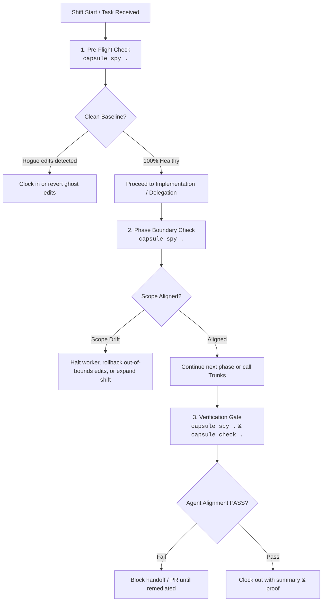

# Watchdog Spy Skill (King Kai Runbook)

Use this skill to autonomously surveil workspace state, detect agent scope drift, catch rogue/ghost modifications, and enforce alignment across single-agent and multi-agent workflows.

---

## The Core Law of Telepathic Surveillance

> *"Delegating is not supervising. If you don't spy on what your workers are touching, they will wander off Snake Way and blow up the entire timeline."*

Autonomous agents must not wait for the developer to prompt: *"Hey, can King Kai check on this?"*
Instead, **make the right spy decisions autonomously** at defined lifecycle triggers.

---

## The Telepathic Decision Framework: When to Spy

Every AI agent, coordinator (`@Piccolo` / `@Whis`), builder (`@Goku`), and reviewer (`@Trunks`) must make spy decisions at these exact moments:



### 1. Pre-Flight Sanity Check (Shift Start)
- **When:** Before touching any code or immediately after clocking in.
- **Why:** Catch unbudgeted changes left behind by previous sessions or other agents (`ROGUE_ACTIVITY`).
- **Action:** Run `capsule spy .`.
- **Verdict Check:** If dirty files exist and no shift covers them, either revert them or claim them explicitly with `capsule clock-in --files "..."`.

### 2. Phase Boundary & Delegation Checkpoint (Orchestration)
- **When:** Whenever `@Piccolo` or `@Whis` delegates a slice to subagents, or at each phase transition of an epic, or every ~10 minutes.
- **Why:** Catch wandering subagents before speculative refactors spread across the repo.
- **Action:** Run `capsule spy --json .` and inspect the issues array.
- **Verdict Check:** If any subagent touched out-of-bounds files, intervene immediately: order rollback of unbudgeted files.

### 3. Implementation Boundary Guarding (Builder Self-Check)
- **When:** Before handing diffs back to the coordinator or reviewer.
- **Why:** Goku must verify that every modified file is strictly within his claimed `--files` grant.
- **Action:** Compare `git status --porcelain` against claimed files or run `capsule spy .`.
- **Verdict Check:** If an unforeseen file had to be edited, do not hide it—expand shift grant with `capsule clock-in --files ...` and record justification in the Task Brief ledger.

### 4. Hard Verification Gate (Trunks Review)
- **When:** During the verification phase before declaring any task complete or opening a PR.
- **Why:** Ensure zero scope drift, zero unclaimed file touches, and zero unbudgeted manifest mutations.
- **Action:** `capsule check .` (which automatically executes the **Agent Alignment** gate) and `capsule spy .`.
- **Verdict Check:** Both must pass with exit code 0. If `SCOPE_DRIFT` is flagged, the gate **fails closed**.

---

## Deviation Taxonomy & Remediation Matrix

| Deviation Type | Trigger Condition | Severity | King Kai's Remediation |
| :--- | :--- | :--- | :--- |
| **`ROGUE_ACTIVITY`** | Uncommitted git modifications exist while 0 active shifts are in `.capsule/room.json`. | 🚨 **FAIL** | **HALT:** Freelance edits detected. Run `capsule clock-in --task "..." --files "..."` or run `git checkout -- .` to discard ghost edits. |
| **`SCOPE_DRIFT`** | Working tree modifies files not claimed in active shift's `--files` parameter. | 🚨 **FAIL** | **INTERVENE:** Off-path wander detected. Demand immediate rollback of out-of-bounds files, or re-clock-in with expanded `--files` grant if legitimate. |
| **`STALE_SHIFT`** | Shift active for > 15m without `capsule heartbeat`. | ⚠️ **WARN** | **REFRESH:** Issue `capsule heartbeat` to refresh active session, or `capsule clock-out` if work was abandoned. |
| **`DEPENDENCY_TAMPERING`**| `package.json`, `Cargo.toml`, `go.mod`, etc. modified without explicit grant. | ⚠️ **WARN** | **AUDIT:** Supply chain modification. Revert package additions unless explicitly specified in Task Brief constraints. |

---

## CLI Reference

```bash
# Standard human-readable audit
capsule spy .

# Machine-readable JSON output for coordinator inspection
capsule spy --json .

# Strict mode: fail with exit code 1 on warnings (stale shifts, manifest edits)
capsule spy --strict .

# Automated verification check (Agent Alignment gate auto-activates when on shift)
capsule check .

# Strict verification gate before finishing task or PR
capsule verify .
```

---

## Handoff Contract
- **PASS (Aligned):** Output contains `Status: ALIGNED (Verdict: PASS)` and exit code 0.
- **FAIL (Drift Detected):** Output contains specific out-of-bounds file paths and explicit remediation instruction. Handoff is blocked until corrected.
